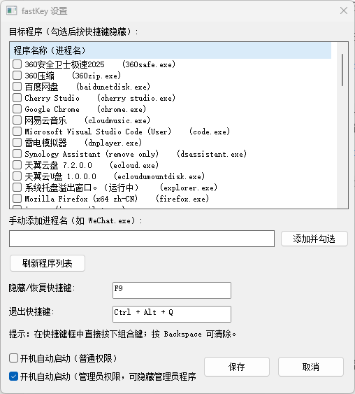
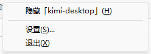

# fastKey — 一键隐藏指定程序窗口及任务栏图标

按自定义快捷键，瞬间把指定程序的窗口和任务栏图标一起隐藏；再按一次原样恢复。
带系统托盘图标和图形设置界面，快捷键与目标程序全部可视化配置。

## 界面截图





## 使用方法

1. 双击运行 `fastKey.exe`（后台驻留，托盘区出现 FK 图标）。
2. **右键托盘图标 → 设置**，打开图形设置界面：
   - **目标程序列表**：自动汇总"已安装程序"（注册表 Uninstall 枚举）和"正在运行的程序"，勾选即可
   - **手动添加进程名**：列表里没有的（如绿色软件）直接输入进程名添加
   - **快捷键**：在输入框中直接按下组合键完成录入，按 Backspace 可清除
   - **开机自动启动**：勾选后开机自动托盘驻留（写入注册表 `HKCU\...\Run`，仅当前用户，无需管理员权限）
   - 点 **保存** 立即生效，无需重启
3. 按快捷键（默认/当前为 `F9`，以你的设置为准）：隐藏所有勾选程序的窗口（任务栏图标同时消失）；再按一次：恢复并前置。
4. **托盘菜单"隐藏「xxx」"**：右键托盘图标，第一项即当前活动窗口的标题，点击可直接隐藏它——无需预先配置目标，按热键即可恢复（与常规隐藏共用恢复机制）。桌面、任务栏及 fastKey 自身窗口会自动排除，不可隐藏时菜单项置灰。
5. 退出：托盘菜单"退出"，或按退出快捷键（默认 `Ctrl+Alt+Q`）。**退出前会自动恢复所有被隐藏的窗口。**

> 单实例保护：重复启动 `fastKey.exe` 不会产生第二个进程；若带 `-settings` 参数启动，会直接唤出已运行实例的设置窗口。

## 关于管理员权限（重要）

Windows 安全机制（UIPI）**禁止普通权限程序操作以管理员身份运行的窗口**——雷神加速器、部分游戏（如开了"以管理员运行"兼容模式的帝国时代2）、部分以管理员启动的 Steam 都属于此类。

fastKey 的应对：

- 隐藏失败时会明确提示"目标以管理员权限运行"，不会假装成功
- **右键托盘 → "以管理员身份重启"**：通过 UAC 提权后，即可正常隐藏这些程序（提权后隐藏普通程序也不受影响）
- 托盘菜单仅在当前为普通权限时显示该项；启动日志（`fastKey.log`）会记录当前权限级别

注意：

- **普通权限自启**写入注册表 Run 键；**管理员权限自启**通过计划任务（"fastKey AutoStart"，登录时以最高权限运行）实现，两者互斥——勾选管理员自启会自动移除普通自启
- 创建最高权限计划任务本身需要管理员权限：勾选"管理员权限"保存时，若 fastKey 当前为普通权限，会弹**一次 UAC** 由提权辅助进程完成创建（之后不再提示）；若 fastKey 已是管理员模式（托盘"以管理员身份重启"），则直接创建无弹窗
- 全屏独占模式的游戏建议改为**无边框窗口**模式，隐藏更稳定（独占全屏下部分游戏会立即抢回显示）

运行日志写入同目录 `fastKey.log`。

## 设置界面

- 列表条目格式：`程序名称 (进程名.exe)`，已勾选的是当前生效的目标
- 配置中存在但程序未运行/未安装检测到的目标，会显示为 `xxx（来自当前配置）` 并保持勾选，不会被丢弃
- 按窗口标题匹配的目标（`titleContains`）不在列表中显示，保存时自动保留

## 配置文件

`config.json` 与 exe 同目录，由设置界面自动维护，也可手工编辑：

```json
{
  "hotkey": "F9",
  "exitHotkey": "Ctrl+Alt+Q",
  "targets": [
    { "process": "notepad.exe" },
    { "titleContains": "计算器" }
  ]
}
```

| 字段 | 说明 |
|------|------|
| `hotkey` | 隐藏/恢复切换热键。修饰键：`Ctrl` `Alt` `Shift` `Win`，用 `+` 连接，主键放最后 |
| `exitHotkey` | 退出程序热键，留空 `""` 禁用 |
| `targets[].process` | 目标进程名（不区分大小写），如 `notepad.exe`、`WeChat.exe` |
| `targets[].titleContains` | 按窗口标题包含文本匹配（不区分大小写） |

支持的主键：字母 A-Z、数字 0-9、F1-F24、`Space` `Tab` `Esc` `Enter`、方向键、小键盘 `Num0`-`Num9` 等。

> 注意：热键控件不支持录入 Win 键组合（可手工编辑 config.json 实现）；若热键注册失败（被其他程序占用），启动时会弹窗提示，进设置换一个即可。

## 原理

- `RegisterHotKey` 注册全局热键，隐藏消息窗口 + `GetMessage` 消息循环处理 `WM_HOTKEY`
- 托盘：`Shell_NotifyIconW`，右键弹出菜单（设置/退出）
- 设置界面：原生 Win32 控件（带复选框的 ListView、`msctls_hotkey32` 热键捕获控件）
- 已安装程序：枚举注册表 `HKLM/HKCU\SOFTWARE\Microsoft\Windows\CurrentVersion\Uninstall`（含 32/64 位视图）
- 开机自启动：写入/删除 `HKCU\SOFTWARE\Microsoft\Windows\CurrentVersion\Run` 的 `fastKey` 值
- 单实例：命名互斥体 `fastKeySingleInstanceMutex`，第二实例退出并转发"打开设置"消息
- 隐藏：窗口扩展样式去 `WS_EX_APPWINDOW`、加 `WS_EX_TOOLWINDOW`（任务栏图标消失），再 `ShowWindow(SW_HIDE)`
- 托盘菜单"隐藏当前活动窗口"：弹菜单前先捕获前台窗口（菜单弹出会抢焦点），点击后隐藏；桌面/任务栏/自身窗口自动排除
- 恢复：还原原始扩展样式 + `ShowWindow(SW_SHOW)` + 置前
- 被隐藏窗口的原始样式记录在内存中，程序退出时自动全部恢复

## 重新编译

双击 `build.bat` 即可（使用本目录下自带的便携版 Go 1.23.4，无需安装环境）。
`fastKey.exe.manifest`（Common Controls v6 / DPI 感知）需与 exe 放在一起。

## 文件清单

| 文件 | 说明 |
|------|------|
| `fastKey.exe` | 正式版（无控制台窗口，托盘驻留） |
| `fastKey-test.exe` | 测试版（带控制台），`fastKey-test.exe -test` 自检隐藏/恢复 |
| `main.go` | 主程序：配置、热键、隐藏/恢复、托盘、消息循环 |
| `gui.go` | 图形设置窗口 |
| `registry.go` | 已安装/运行中程序枚举 |
| `icon.ico` | 托盘图标（嵌入 exe） |
| `fastKey.exe.manifest` | 控件样式 manifest，需与 exe 同目录 |
| `config.json` | 配置文件 |
| `test_hotkey.py` | 热键端到端测试（读取 config 模拟真实按键） |
| `test_settings.py` | 设置窗口自动化测试 |
| `test_autostart.py` | 开机自启动开关端到端测试 |
| `test_tray_hide.py` | 托盘"隐藏当前活动窗口"端到端测试 |
| `go/` | 便携版 Go 1.23.4 工具链 |
